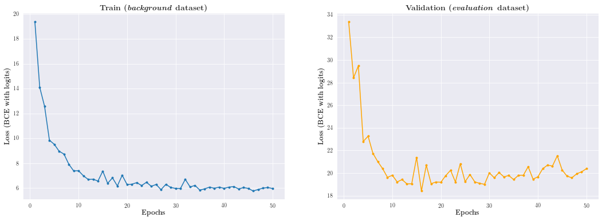

To train the model with PyTorch Lightning (it is almost 2.5 times faster than native PyTorch for this task)
```
python train_lightning.py --config=config.yml
```

Or to train in native PyTorch
```
python train_pytorch.py \
--batch-size=128 \
--epochs=50 \
--lr=0.001 \
--weight_decay=0.001 \
--num_workers=4 \
--run=1 \
--cuda
```

To run Tensorboard 

```
tensorboard --logdir=<directory>
```



## References

- [Auto Structuring Deep Learning Projects with the Lightning CLI](https://devblog.pytorchlightning.ai/auto-structuring-deep-learning-projects-with-the-lightning-cli-9f40f1ef8b36)
- [LightningModule](https://pytorch-lightning.readthedocs.io/en/latest/common/lightning_module.html)
- [Lightning CLI and config files](https://pytorch-lightning.readthedocs.io/en/stable/common/lightning_cli.html)
- [PyTorch Lightning Docs](https://pytorch-lightning.readthedocs.io/en/latest/index.html)